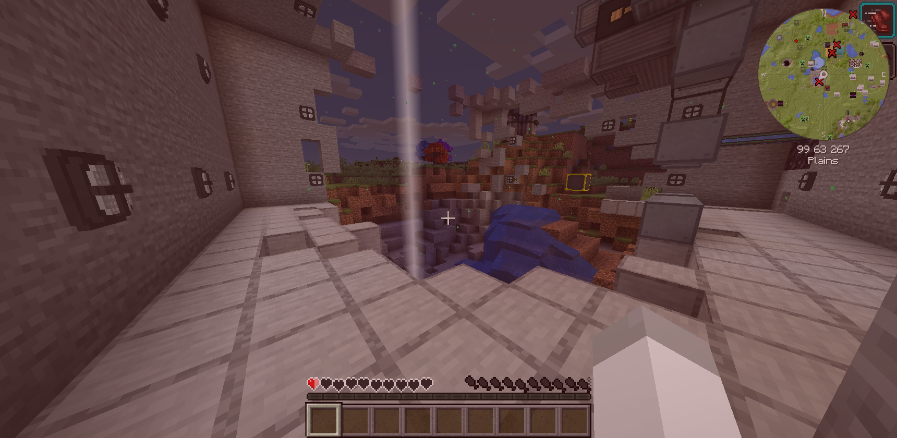

# MC Management Engine

Modded Minecraft requires a hefty VM in order to play smoothly, but a typical server is only in use around 10% of the time it's active. This project seeks to reduce cost by allowing a user to start/stop the Minecraft VM using a Discord bot—preventing billing while the server is not in use. In addition to reducing cost, this project also seeks to ease administration duties by exposing some Minecraft commands through the Discord bot (such as whitelisting) and keeping tabs on the server status.

This project is composed of three respositiories:
* [prototypicalpro/discord-mc-server](https://github.com/prototypicalpro/discord-mc-server) - Python management layer that controls the MC server instance on the server VM.
* [mirrorkeydev/discord-mc-bot](https://github.com/mirrorkeydev/discord-mc-bot) - Go Discord bot that communicates with the Google Cloud API and the management layer.
* [prototypicalpro/discord-mc-protobuf](https://github.com/prototypicalpro/discord-mc-protobuf) - Protobufs used for gRPC communication between the Discord bot and management layer.

This project was successfully deployed for ~3 months managing a server running [FTB Endeavor](https://www.feed-the-beast.com/modpack/ftb_endeavour) on a [`c2-standard-8`](https://cloud.google.com/compute/docs/compute-optimized-machines) machine (8 vCPUs and 32GB RAM). Thanks to this project we were able to use a premtible VM that was off most of the time—leading to a total project cost of $34.19 instead of the expected $1000 on the Minecraft VM alone.

The project was retired when, in his experiments with nuclear power, a player layered the entire homestead with uninhabitable radiation—and while a backup was restored and the problem was resolved, too much progress has been lost to continue. An photograph recovered from this tragedy is shown below.

